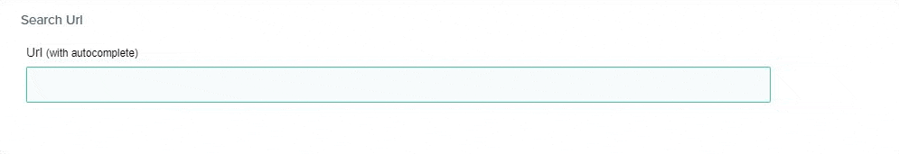

# Input Search Url Autocomplete - ContentStack Extension UI

Cette extension de ContentStack permet aux équipes marketing de remplir une url depuis un champ avec autocomplétion.

Lorsqu'un utilisateur tape une url, une recherche est réalisée parmi toutes les pages renseignées dans ContentStack et affiche toutes les urls associées à la recherche dans l'autocompletion.



## Project setup
```
npm install
```

### Compiles
```
npm run build:main
```

### Run tests
```
npm run test:unit
```
